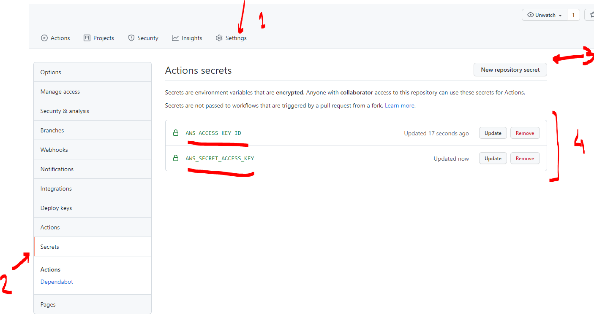

# fg-challenge

Flugel technical challenge.

## Requirements

### TEST 1

- Create Terraform code to create an S3 bucket and an EC2 instance. Both resources must be tagged with Name=Flugel, Owner=InfraTeam.
- Using Terratest, create the test automation for the Terraform code, validating that both resources are tagged properly.
- Setup Github Actions to run a pipeline to validate this code.
- Publish your code in a public GitHub repository, and share a Pull Request with your code. Do not merge into master until the PR is approved.
- Include documentation describing the steps to run and test the automation.

### TEST 2

Complete the test #1 + the following actions:

- Merge any pending PR.
- Create a new PR with code and updated documentation for the new requirement.
- I want a cluster of 2 EC2 instances behind an ALB running Nginx, serving a static file. This static file must be generated at boot, using a Python script. Put the AWS instance tags in the file.
- The cluster must be deployed in a new VPC. This VPC must have only one public subnet. Do not use default VPC
- Update the tests to validate the infrastructure. The test must check that files are reachable in the ALB.

## Terraform code to create S3 bucket and EC2 instance

References:

- [https://registry.terraform.io/providers/hashicorp/aws/latest/docs](https://registry.terraform.io/providers/hashicorp/aws/latest/docs)
- [https://registry.terraform.io/providers/hashicorp/aws/latest/docs/resources/s3_bucket](https://registry.terraform.io/providers/hashicorp/aws/latest/docs/resources/s3_bucket)
- [https://registry.terraform.io/providers/hashicorp/aws/latest/docs/resources/instance](https://registry.terraform.io/providers/hashicorp/aws/latest/docs/resources/instance)

Create Terraform code to create an S3 bucket and an EC2 instance. Both resources must be tagged with *Name=Flugel*, *Owner=InfraTeam*.

Configure any custom AWS variable in **terraform.tfvars** file (you can use *terraform.tfvars.sample* as reference). If not, default values will be used. A word of caution, however: S3 name are globally unique so there script will probably not work if you use default values for the bucket name.

1. *terraform plan/apply* will require aws credentials to run. It is recommended to provide these credentials as *environment variables* like this:

    ```console
    export AWS_ACCESS_KEY_ID="anaccesskey"
    export AWS_SECRET_ACCESS_KEY="asecretkey"
    ```

1. Initialize terraform:

    ```console
    terraform init
    ```

1. Run terraform plan to check if there is something missing:

    ```console
    terraform plan
    ```

1. Apply terraform:

    ```console
    terraform apply --auto-approve
    ```

An s3 bucket and a EC2 instance should be created.

## Automate test of the Terraform code with Terratest

References:

- [https://terratest.gruntwork.io/docs/](https://terratest.gruntwork.io/docs/)

Using *Terratest*, create the test automation for the Terraform code, validating that both resources are tagged properly.

*test* directory includes the testing code for Terratest.

1. Change to *test* directory:

    ```console
    cd test
    ```

1. Initializa terratest for the modules

    ```console
    go mod init "modules"
    go mod tidy
    ```

1. Run the test

    ```console
    go test -v -timeout 30m
    ```

1. Both test will run in parallel. You should get "PASS" messages, like these:

    ```console
       ...
    TestS3Tags 2021-10-16T18:18:17-04:00 logger.go:66: Destroy complete! Resources: 1 destroyed.
    --- PASS: TestS3Tags (47.42s)
       ...
    --- PASS: TestInstanceTags (117.24s)
    PASS
    ok      modules 117.243s
    ```

## Run terratest from Github action

References:

- [https://dev.to/mnsanfilippo/testing-iac-with-terratest-and-github-actions-okh](https://dev.to/mnsanfilippo/testing-iac-with-terratest-and-github-actions-okh)

Setup Github Actions to run a pipeline to validate this code.

To use this from Github actions, required AWS credentials should be configured as secrets in the repository.



This is the content of the workflow used for the action:

```yaml
name: Testing AWS resource tags
on:
push:
    branches:
    - tf-s3-ec2
pull_request:
    branches:
    - tf-s3-ec2
    -
jobs:
test:
    runs-on: ubuntu-latest
    env:
    AWS_ACCESS_KEY_ID: ${{ secrets.AWS_ACCESS_KEY_ID }}
    AWS_SECRET_ACCESS_KEY: ${{ secrets.AWS_SECRET_ACCESS_KEY }}

    steps:
    - uses: actions/checkout@v2
    - name: Set up Go
      uses: actions/setup-go@v2
      with:
        go-version: 1.17

    - name: Setup Dependencies
      working-directory: test/
      run:  go get -v -t -d && go mod tidy

    - name: Test
      working-directory: test/
      run: go test -v
```

## Publish your code in a public GitHub repository

Publish your code in a public GitHub repository, and share a Pull Request with your code. Do not merge into master until the PR is approved.

You are in the Github repository right now.

GH Pull request: [https://github.com/rjrpaz/fg-challenge/pull/1](https://github.com/rjrpaz/fg-challenge/pull/1)

## Include documentation

Include documentation describing the steps to run and test the automation.

Being this a fully automated test, only required step is to commit new code to a specific branch to run the test.

It is recommended to include the development branchs where the test is going to run in the github actions workflow: [.github/workflows/check_tag.yml](.github/workflows/check_tag.yml)

```yaml
   ...
name: Testing AWS resource tags
on:
push:
    branches:
    - tf-s3-ec2
    - add-your-own-branch-here
pull_request:
    branches:
    - tf-s3-ec2
    - add-your-own-branch-here
    -
   ...
```
